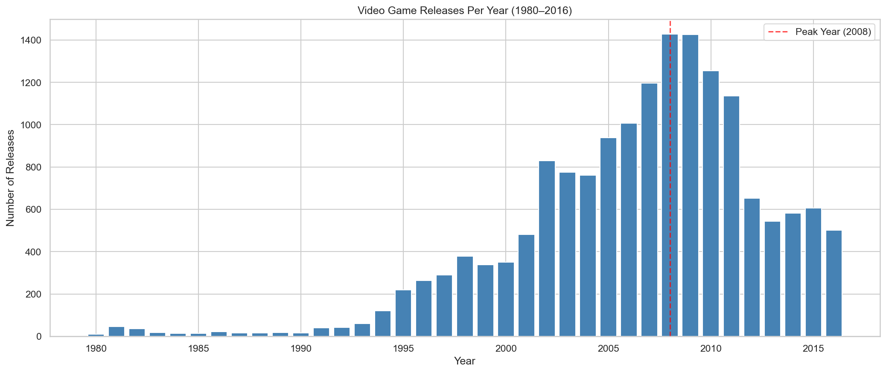
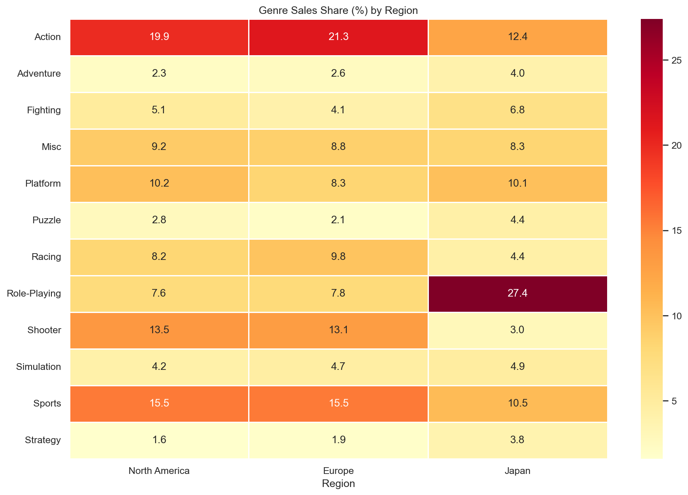
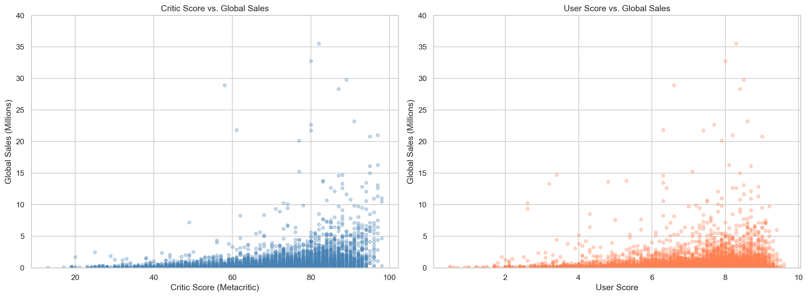
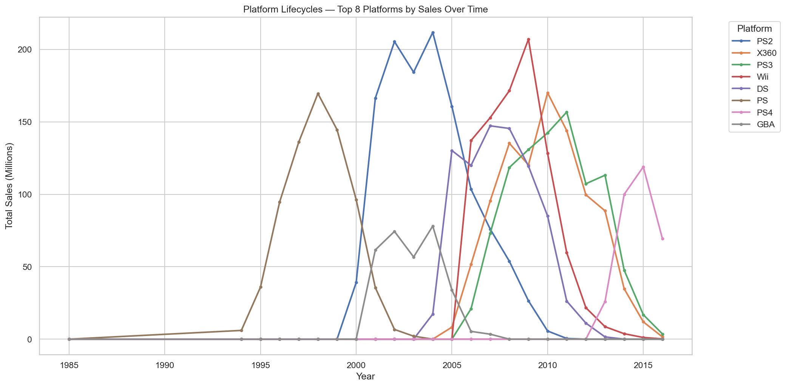

# Video Game Sales & Ratings Analysis

An exploratory data analysis of **16,000+ video game titles** spanning 1980–2016, examining global sales trends, regional market differences, genre dynamics, and the relationship between critical reception and commercial success.



## Project Overview

The gaming industry generates billions in revenue annually, yet understanding what drives commercial success remains complex. This analysis digs into historical sales and ratings data to uncover patterns that matter to publishers, developers, and analysts.

### Key Questions Explored
- How has the gaming market evolved from 1980 to 2016?
- Which genres dominated, and does this vary by region?
- Do higher review scores lead to higher sales?
- What do platform lifecycles tell us about the console market?
- Which publishers have been most commercially successful?

## Key Findings

### 1. Market Peak & Decline
The industry hit peak physical game releases around **2008–2009**, followed by a steady decline — likely driven by the shift to digital distribution and mobile gaming, which this dataset does not capture.

### 2. Regional Genre Preferences
North America and Europe favor **Action** and **Shooter** genres, while Japan shows a significantly stronger preference for **Role-Playing games**. This has direct implications for regional marketing and localization strategy.



### 3. Reviews ≠ Guaranteed Sales
Critic scores show a **moderate positive correlation** with global sales, but the wide spread at every score bracket confirms that reviews alone don't determine success. Franchise power, marketing, and platform availability play major roles.



### 4. Platform Lifecycles
Console generations are clearly visible in the data, with distinct rise-peak-decline curves for each platform. The PS2 era stands out as the historical peak in unit sales.



## Tools & Technologies

- **Python 3.14**
- **pandas** — data manipulation and cleaning
- **NumPy** — numerical operations
- **Matplotlib** — static visualizations
- **Seaborn** — statistical visualizations and heatmaps
- **Jupyter Notebook** — interactive analysis environment

## Project Structure

```
game-sales-analysis/
├── data/                          # Raw dataset (CSV)
├── notebooks/
│   └── game_sales_analysis.ipynb  # Full analysis notebook
├── images/                        # Saved visualizations
├── requirements.txt               # Python dependencies
└── README.md
```

## Getting Started

### Prerequisites
- Python 3.10+
- pip

### Installation
```bash
# Clone the repository
git clone https://github.com/rush2pranav/game-sales-analysis
cd game-sales-analysis

# Install dependencies
pip install -r requirements.txt

# Launch the notebook
jupyter notebook notebooks/game_sales_analysis.ipynb
```

### Dataset
Download the [Video Game Sales with Ratings](https://www.kaggle.com/datasets/rush4ratio/video-game-sales-with-ratings) dataset from Kaggle and place the CSV file in the `data/` folder.

## Visualizations

| Chart | Description |
|-------|-------------|
| Releases Per Year | Bar chart showing industry growth and the 2008 peak |
| Sales by Region Over Time | Stacked area chart of regional sales trends |
| Genre Sales by Region | Horizontal stacked bar chart comparing genre performance |
| Genre Heatmap | Percentage-based heatmap of regional genre preferences |
| Critic/User Scores vs Sales | Scatter plots with correlation analysis |
| Sales by Score Bracket | Mean vs median comparison across review tiers |
| Top Publishers | Horizontal bar chart of the 15 largest publishers |
| Platform Lifecycles | Line chart showing rise and fall of major consoles |

## What I Learned

- **Data cleaning is half the work.** Converting mixed types, handling 'tbd' strings in numeric columns, and deciding how to treat missing values required careful thought.
- **Aggregation hides stories.** The mean vs. median sales gap revealed that a few mega-hits skew averages at every score level — something you miss if you only look at one metric.
- **Regional data tells a different story than global.** The Japan vs. Western market genre split is dramatic and would meaningfully impact a publisher's strategy.
- **Domain context matters.** Understanding that this dataset misses digital sales completely changes how you interpret the post-2010 decline.

## Limitations & Next Steps

**Limitations:**
- Physical sales only — digital distribution (Steam, PSN, eShop) not captured
- Data completeness drops off after 2013
- User scores have significant missing values

**Next Steps:**
- Incorporate digital sales data for a more complete market picture
- Build time-series forecasts for genre trends
- Analyze publisher strategy evolution (genre diversification over time)

## License

This project is licensed under the MIT License — see the [LICENSE](LICENSE) file for details.

---

*Built as part of a Game Data Analytics portfolio. Open to feedback — feel free to open an issue or connect with me on [LinkedIn](https://www.linkedin.com/in/phulpagarpranav/).*